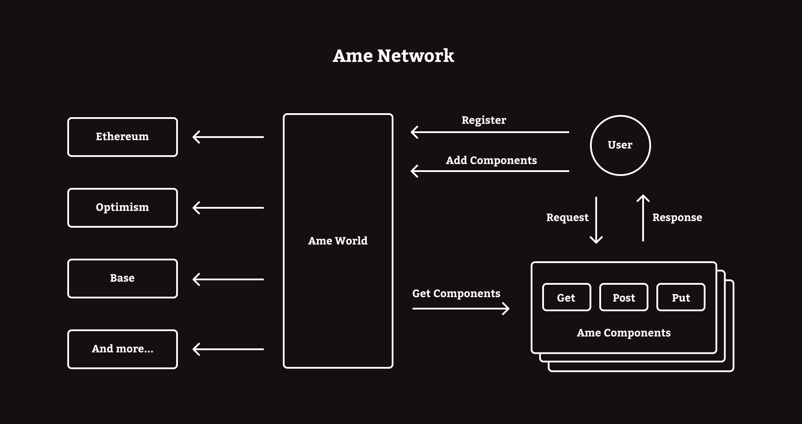

## Introduction
[Ame Network](https://ame.network) is a composable social network. Developers can easily create various composable components by implementing the IComponent interface, thereby providing users with a richer and more personalized social experience.  
It consists of two core parts, Ame World and Ame Component.   



## Ame World
Ame World is a component management contract deployed on each chain. Users can manage their own components by interacting with Ame World.

### IAmeWorld.sol ###
- `register` Register a new user.  
- `isRegistered` Check if user is registered.  
- `addComponents` User adds some components.   
- `removeComponents` User removes some components.  
- `getComponents` Get the components that the user has added.  
- `hasComponent` Check whether the user has registered a component.

### Ame World Contracts ###
| Chain | Address |
| ----------- | ----------- |
| OP Sepolia  | 0xAFAcad0039eE54C31b0f6E44186a8113A3531334 |
| Base Sepolia | 0xAFAcad0039eE54C31b0f6E44186a8113A3531334 |
| Zora Sepolia   | 0xAFAcad0039eE54C31b0f6E44186a8113A3531334 |
| OpBNB  | 0xAFAcad0039eE54C31b0f6E44186a8113A3531334 |
| Redstone Holysky  | 0x736F3D2169B42eFbD4a7A4f760ebd4f5907Ef57e |


## Ame Component
Component is a container for user data. Component developers can customize `get`, `post`, and `put` to provide users with request methods for operating data.

### IComponent.sol ###
- `getMethods` Get method names based on request method type.  
- `getMethodReqAndRes` Get the data types of request parameters and return parameters based on the requested method name.  
- `get` Request the contract to retrieve records.  
- `post` Request the contract to create a new record.
- `put` Request the contract to update a record. 
- `options` Supported request method types. 

### Component Example ###
This is an example of profiles component.
1. Users can create new profiles by calling the `createUser` method of post.
2. Users can query profiles by calling the `getUser` method of get.
3. Users can change the name by calling the `updateUserName` method of put.
```solidity
// SPDX-License-Identifier: GPL-3.0
pragma solidity >=0.8.0;
import "./Types.sol";
import "./IComponent.sol";
contract Component is IComponent{

    //@dev define the data type of this component
    struct Profiles{
        string name;
        uint256 age;
    }

    mapping (address=>Profiles) users;

    //@dev Types contains all data types in solidity
    mapping (string=>Types.Type[]) methodRequests;
    mapping (string=>Types.Type[]) methodResponses;
    mapping (MethodTypes=>string[]) methods;

    constructor(){
        Types.Type[] memory getReqArray = new Types.Type[](1);
        getReqArray[0] = Types.Type.ADDRESS;
        Types.Type[] memory dataTypeArray = new Types.Type[](2);
        dataTypeArray[0] = Types.Type.STRING;
        dataTypeArray[1] = Types.Type.UINT256;
        Types.Type[] memory putReqArray = new Types.Type[](3);
        putReqArray[0] = Types.Type.ADDRESS;
        putReqArray[1] = Types.Type.STRING;
        putReqArray[2] = Types.Type.UINT256;
        // @dev initialize get, post, put request parameter data types and response data types
        setMethod("getUser",MethodTypes.GET,getReqArray,dataTypeArray);
        setMethod("createUser",MethodTypes.POST,dataTypeArray,new Types.Type[](0));
        setMethod("updateUserName",MethodTypes.PUT,putReqArray,new Types.Type[](0));
    }

    function setMethod(string memory _methodName,MethodTypes _methodType,Types.Type[] memory _methodReq,Types.Type[] memory _methodRes)  private  {
        methods[_methodType].push(_methodName);
        methodRequests[_methodName]=_methodReq;
        methodResponses[_methodName]=_methodRes;
    }

    function getMethodReqAndRes(string memory _methodName)public view returns(Types.Type[] memory ,Types.Type[] memory ){
        return(
            methodRequests[_methodName],
            methodResponses[_methodName]
        );
    }
    
    function getMethods(MethodTypes _methodTypes)public view returns (string[] memory){
        return methods[_methodTypes];
    } 

    function get(string memory _methodName,bytes memory _methodReq)public view returns(bytes memory){
        if(compareStrings(_methodName,"getUser")){
            address user=abi.decode(_methodReq, (address));
            bytes memory userData=abi.encode(users[user].name,users[user].age);
            return userData;
        }else{
            return abi.encode("");
        }  
    }

    function post(string memory _methodName,bytes memory _methodReq)public returns(bytes memory){
        if(compareStrings(_methodName,"createUser")){
            (string memory name,uint256 age)=abi.decode(_methodReq, (string,uint256));
            users[msg.sender]=Profiles(name,age);
            
        }
        return abi.encode("");
    }

    function put(string memory _methodName,bytes memory _methodReq)public returns(bytes memory){
        if(compareStrings(_methodName,"updateUserName")){
            (string memory name)=abi.decode(_methodReq, (string));
            users[msg.sender].name=name;
            return abi.encode("");
        } 
        return abi.encode("");
    }
    
    function options()public pure returns(MethodTypes[] memory){
        MethodTypes[] memory methodTypes=new MethodTypes[](4);
        methodTypes[0]=MethodTypes.GET;
        methodTypes[1]=MethodTypes.POST;
        methodTypes[2]=MethodTypes.PUT;
        methodTypes[3]=MethodTypes.OPTIONS;
        return methodTypes;
    }

    //@dev compares two strings for equality
    function compareStrings(string memory _a, string memory _b) private  pure returns (bool) {
        return keccak256(abi.encodePacked(_a)) == keccak256(abi.encodePacked(_b));
    }
}

```

### Developer FAQ ###
**How to customize response status code?**

The return value type of each request method is bytes, so you can customize the response status code and other response information according to your needs.

**How to disable a request method?**

You can add a mapping(string=>bool) to save the request method name and available state. After the application is upgraded, manually set the available state of the disabled request method to false. And check the state every time a request is processed.

**Why is there no delete method type?**

The data in smart contracts is public, and deleting data is an inefficient operation. In order to facilitate data management and retrieval, you can add a mapping to save the valid state of the data, and add a put request method to set valid and invalid data. And only return valid data in get method.

**How to dynamically add new request methods?**

Before deploying the contract, you can add a mapping (address=>bool) to record the external contract permissions. When the application adds new functions, give the v2 contract write permissions and add new request methods to the v2 contract.

**How to encode request parameters and decode response?**

Use ```getMethodReqAndRes``` to get the data type of the method request parameters and the data type of the response value. Then use some js library to encode and decode it.   
For example:   

```javascript
var reqDataEncode = web3.eth.abi.encodeParameters(
  ["string", "uint256"],
  ["alice", "1"]
);

var resDataDecode = web3.eth.abi.decodeParameters(
  ["string", "uint256"],
  reqDataEncode
);
```

### Disclaimer ###
All code in this repo has not been audited for security. Ame is an open, permissionless, community-based onchain social network. Currently it does not have any token.